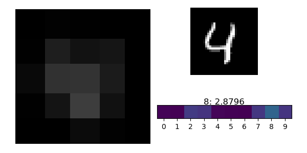

# Adaptive focus for images
My experiments on neural nets that use adaptive focus to attend informative regions of an image

## CIFAR10

### 9x9 thumbnail and 4 9x9 patches, Gumbel-Softmax

## MNIST 32x32

### 5x5 thumbnail and 4 5x5 patches, Gumbel-Softmax

### 5x5 thumbnail and 4 5x5 patches, Bilinear

